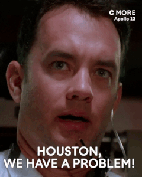

background-image: url(img/ruben-rodriguez-IXTvnOOSTyU-unsplash.jpg)
background-size: cover

```{r setup, include=FALSE}
options(htmltools.dir.version = FALSE)
```

class: center, middle, inverse

# Ensino técnico

---
# Experiências - Transporte de Cargas - 3o ano

```{r, echo=FALSE}

```
---
# Projeto integrador


.center[
#### Primeira etapa: **Definir um problema a ser investigado**


### 8 horas-aula esperando proposição dos alunos!


```{r echo=FALSE, message=FALSE, warning=FALSE}
knitr::include_graphics("img/75a4ce3f7943cfa72f70b63a77a57837.gif")
```
]

---
# "Quebra-cabeças"
.pull-left[
### Atividade:
- Organizar modos de transportes, atributos e respectivas características
- Trabalho em grupo
]

.pull-right[
### Material
- Cartolina
- Cola
- Fichas impressas com as características
- computador - Google
]

.center[
```{r echo=FALSE, message=FALSE, warning=FALSE, out.width="80%"}

```
]
---
# "Quebra-cabeças"

### Fechamento da atividade
- Gincana de perguntas: meninos contra meninas

.pull-left[
```{r echo=FALSE, message=FALSE, warning=FALSE, out.width="60%"}

```
]

--

.pull-right[
```{r echo=FALSE, message=FALSE, warning=FALSE, out.width="80%"}

```
]

---

background-image: url(img/fran-innocenti-nOwkd4YvdUg-unsplash.jpg)
background-size: cover

class: center, inverse
# Tecnologia em sala

---
background-image: url(img/nastuh-abootalebi-ZtC4_rPCRXA-unsplash.jpg)
background-size: cover

class: center, inverse, middle
# Ensino superior

---
# Situações-Problema
### 1. PLANO DE NEGÓCIOS
### 2. "GAMIFICAÇÃO"
.center[
```{r echo=FALSE, message=FALSE, warning=FALSE, out.width="50%"}

```
]

---

# Urbalog


.pull-left[
```{r echo=FALSE, message=FALSE, warning=FALSE, out.width="120%"}

```
]

.pull-right[
```{r echo=FALSE, message=FALSE, warning=FALSE, out.width="120%"}

```
]


.center[
**Sábado letivo**

### 70% da turma presente!
]


---

background-image: url(img/photo-1537202108838-e7072bad1927.jpg)
background-size: cover

class: center, inverse, middle

# Pós-graduação (stricto sensu)

---
# Estruturação de atividades práticas

.center[
```{r echo=FALSE, message=FALSE, warning=FALSE, out.width="80%"}
knitr::include_graphics("img/gis1.png")
```

```{r echo=FALSE, message=FALSE, warning=FALSE, out.width="60%"}

```
]


---
# Estruturação de atividades práticas

.center[
```{r echo=FALSE, message=FALSE, warning=FALSE, out.width="80%"}

```
]

---
# Estruturação de atividades práticas

<iframe width="930" height="503" src="https://www.youtube.com/embed/Y7yvgzSWah8" frameborder="0" allow="accelerometer; autoplay; clipboard-write; encrypted-media; gyroscope; picture-in-picture" allowfullscreen></iframe>

---
# "Ignite Talks"

```{r echo=FALSE, message=FALSE, warning=FALSE, out.width="100%"}

```

---

# Seminário de competências
.center[
```{r, echo=FALSE, out.width="80%"}

```
]

---
background-image: url(img/2.jpg)
background-size: cover

class: center, inverse, middle

# AVALIAÇÃO


---
# Avaliação
.center[
```{r echo=FALSE, message=FALSE, warning=FALSE, out.width="80%"}

```
]
---
# Planejamento

```{r echo=FALSE, message=FALSE, warning=FALSE, out.width="100%"}

```

---

background-image: url(img/christian-erfurt-sxQz2VfoFBE-unsplash.jpg)
background-size: cover

class: center, inverse, middle

# Ensino Remoto Emergencial

---

# Ensino Remoto Emergencial

- Colaboração entre pares
- Atividades diversificadas
- Avaliação incremental e frequente

.center[
<iframe width="894" height="300" src="https://www.youtube.com/embed/GfQfZf4_DUA" frameborder="0" allow="accelerometer; autoplay; clipboard-write; encrypted-media; gyroscope; picture-in-picture" allowfullscreen></iframe>
]
---
background-image: url(img/hannah-busing-Zyx1bK9mqmA-unsplash.jpg)
background-size: cover

class: center, inverse, middle

# Combinado não sai caro!!!!!!!!!!

---

# Documento de início de semestre

```{r, echo=FALSE}

```

---

# Perspectivas

- Autonomia do estudante
- Diversificação de métodos
- Colaboração
- Reflexão

```{r, echo=FALSE, out.width="90%"}

```

---

background-image: url(img/husniati-salma-ldkHWg5s3Ec-unsplash.jpg)
background-size: cover

class: center, inverse, middle

#Inspiração

---

background-image: url(img/noemi-macavei-katocz-Af1TEGN2H9Q-unsplash.jpg)
background-size: cover
class: center, middle


# Obrigada!


